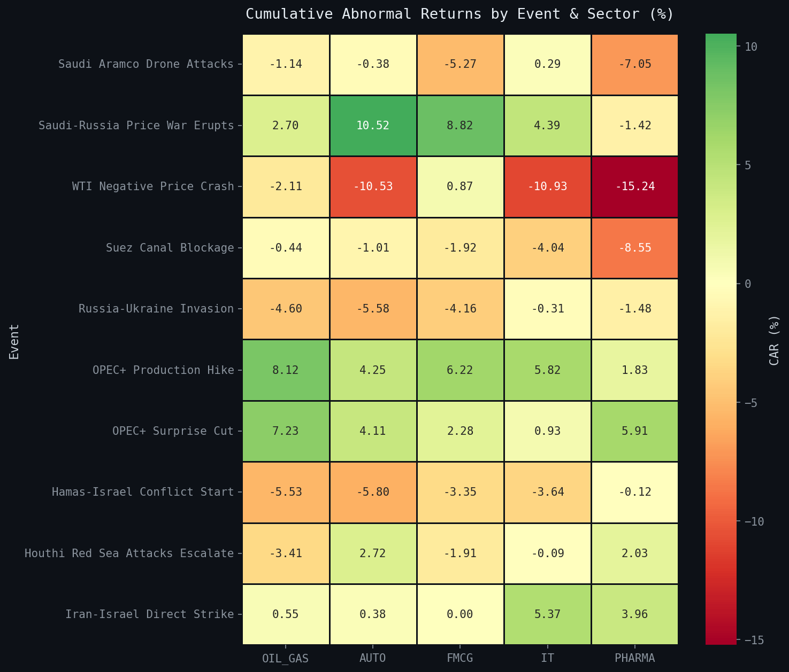
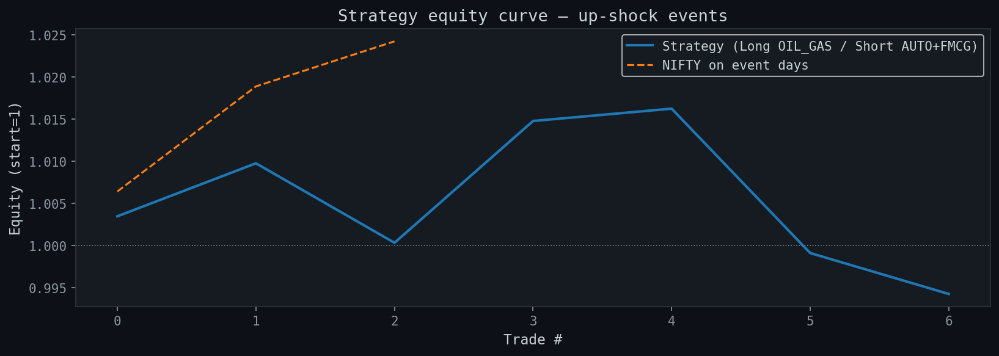
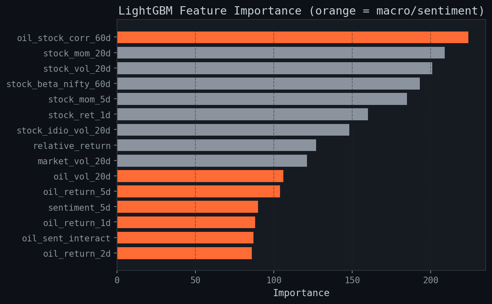

# Oil Supply Shocks, INR Transmission & Indian Sectoral Equity Mispricing

Research repository examining how Brent crude shocks propagate through USD/INR into Indian sectoral equity returns (2019–2026), using event studies, rule-based and ML signal generation, walk-forward portfolio optimisation, and an FX-channel decomposition.

---

## Quick Start

```bash
# 1. Install dependencies
pip install pandas numpy scipy scikit-learn lightgbm matplotlib seaborn \
            pyarrow jupyter yfinance vaderSentiment

# 2. Launch Jupyter
cd macro-alpha-oil-shock-india && jupyter notebook

# 3. Run notebooks in order: 01 → 07
```

No API keys required — all notebooks run fully offline using the cached parquet data.

---

## Notebooks (run in order)

| # | Notebook | What it does |
|---|----------|-------------|
| 01 | `01_data_collection.ipynb` | Load cached prices → log returns → descriptive stats |
| 02 | `02_event_study.ipynb` | Abnormal returns, CAR [−5,+5], t-tests, up/down asymmetry (10 events) |
| 03 | `03_sector_analysis.ipynb` | Oil sensitivity at lags 0/1/2, regime-split correlations |
| 04 | `04_insights.ipynb` | Simple L/S backtest on up-shock events, equity curve |
| 05 | `05_signal_backtest.ipynb` | Rule-based signal engine, threshold sweep, per-event ML predictor |
| 06 | `06_alpha_system.ipynb` | Cross-sectional Ridge/LightGBM, walk-forward CV, OOS portfolio |
| 07 | `07_fx_channel.ipynb` | INR transmission: rolling β decomposition, dual-channel signals, coupling regimes |

---

## Repository Structure

```
macro-alpha-oil-shock-india/
├── src/
│   ├── constants.py      ← SINGLE SOURCE OF TRUTH: SECTOR_MAP, MARKET_COL, OIL_COL, FX_COL
│   ├── data.py           ← load_prices(), log_returns(), save_returns(), load_returns()
│   ├── event_study.py    ← run_event_study(), get_sector_returns(), oil_sensitivity()
│   ├── signals.py        ← detect_shocks(), backtest_signals(), performance_metrics()
│   ├── predictive.py     ← train_all_sectors(), SectorPredictor (LOO IC)
│   ├── features.py       ← build_panel(), build_live_features()
│   ├── model.py          ← AlphaModel (Ridge/LightGBM), walk_forward_cv(), time_split()
│   ├── strategy.py       ← build_portfolio(), daily_pnl(), rank_signals()
│   ├── backtest.py       ← compute_metrics(), compute_ic(), nifty_benchmark()
│   ├── fx_channel.py     ← fx_event_study(), decompose_sector_returns(), dual_channel_signal()
│   ├── events.py         ← detect_events() — algorithmic, no hard-coded dates
│   ├── sentiment.py      ← simulate_sentiment(), score_headlines_vader()
│   ├── pipeline.py       ← daily orchestrator (cron-ready)
│   └── utils.py          ← DATA_PROC, TABLES_DIR, PLOTS_DIR, set_theme(), save_table()
├── data/
│   ├── raw/prices.parquet         ← 1,928 days × 18 columns (Jan 2019 – May 2026)
│   └── processed/returns.parquet  ← log returns, BRENT winsorized at ±25%
├── outputs/
│   ├── plots/   ← all figures saved here by notebooks
│   └── tables/  ← all CSV tables saved here by notebooks
└── notebooks/   ← 01–07, all execute cleanly in order
```

---

## Schema

| Constant | Value | Description |
|----------|-------|-------------|
| `MARKET_COL` | `"NIFTY"` | Broad-market benchmark |
| `OIL_COL` | `"BRENT"` | Brent crude log-returns |
| `FX_COL` | `"USDINR"` | USD/INR rate (higher = weaker INR) |

**Sector → Stock mapping** (from `constants.SECTOR_MAP`):

| Sector | Stocks |
|--------|--------|
| OIL_GAS | RELIANCE, ONGC, IOC, BPCL, HPCL |
| AUTO | TATAMOTORS, MARUTI |
| FMCG | HINDUNILVR, ITC |
| IT | TCS, INFY |
| PHARMA | CIPLA |

All modules import `SECTOR_MAP` from `constants.py` — never duplicated.

---

## Live Pipeline

```bash
python -m src.pipeline --run          # live yfinance + NewsAPI
python -m src.pipeline --run --sim    # offline / dev mode
python -m src.pipeline --status       # data freshness + last signal

# Cron (IST 18:00, weekdays):
# 0 12 * * 1-5  cd /path/to/macro-alpha-oil-shock-india && python -m src.pipeline --run
```

---

## Key Research Findings

**Data:** 1,928 trading days (2 Jan 2019 – 25 May 2026), 15 stocks across 5 sectors,
10 curated oil-shock events (7 positive, 3 negative), identified algorithmically
using a ±3% single-day Brent threshold.

---

### 1 · Event Study (NB02)

Cumulative abnormal returns over [−5, +5] trading days around each event, with NIFTY as the
normal-returns benchmark.

| Sector | Mean CAR (%) | t-stat | p-value |
|--------|:------------:|:------:|:-------:|
| OIL_GAS | +0.14 | 0.09 | 0.928 |
| AUTO | −0.13 | −0.07 | 0.947 |
| FMCG | +0.16 | 0.11 | 0.916 |
| IT | −0.22 | −0.14 | 0.894 |
| PHARMA | −2.02 | −0.99 | 0.350 |



No sector achieves p < 0.05. With only 10 events the study is underpowered (effective df = 9);
the failure to reject reflects sample size, not necessarily the absence of an effect. Extending
the history to 2010 (~21 additional events) is the most direct path to improved statistical power.

**Directional asymmetry (FMCG):** FMCG shows the most economically interesting asymmetry — mean
CAR of −2.05% on up-shocks versus +5.30% on down-shocks (t = −2.90, p = 0.070). This is
marginally significant and consistent with a cost-pass-through story: input-cost relief is
absorbed into margins faster than cost increases are passed on to consumers.

**INR channel:** The USD/INR event study finds a statistically significant INR depreciation
of +0.31% at day −2 (t = 3.33, p = 0.009), suggesting currency markets pre-position ahead of
the realised oil shock by approximately two trading days. No other window day reaches p < 0.05.

---

### 2 · Rule-Based Signal Engine (NB05)

A long/short sector-rotation strategy triggered on ≥3% Brent daily moves,
holding for five trading days with equal-weighted sector legs.

**At the 3% default threshold (149 signals, 75 up / 74 down):**

| Metric | Value |
|--------|-------|
| Hit ratio | 48.3% |
| Mean trade P&L | −0.11% |
| Annualised Sharpe | −0.49 |
| Max drawdown | −22.7% |
| Total return | −16.1% |

Performance degrades primarily around geopolitical tail events (Russia–Ukraine 2022,
Houthi shipping disruptions 2024, Iran–Israel escalation 2024), where the expected
sector rotation is overwhelmed by broad risk-off deleveraging.

**Threshold sensitivity** — raising the detection bar materially improves both hit rate
and drawdown, at the cost of signal frequency:

| Threshold | Signals | Hit ratio | Ann. Sharpe | Max DD |
|:---------:|:-------:|:---------:|:-----------:|:------:|
| 1% | 186 | 45.2% | −0.36 | −20.1% |
| 2% | 169 | 47.3% | −0.20 | −17.2% |
| **3%** | **149** | **48.3%** | **−0.49** | **−22.7%** |
| 4% | 119 | 53.8% | +0.05 | −11.6% |
| 5% | 86 | 55.8% | +0.14 | −5.4% |

The strategy approaches breakeven at thresholds ≥ 4%, suggesting that only the largest
shocks reliably produce the expected sector rotation.



**Per-event ML predictor (LOO IC):** A leave-one-out Ridge predictor trained on the 149 signal
dates yields information coefficients (IC) ranging from −0.18 (PHARMA) to +0.17 (FMCG).
Only FMCG produces a positive IC; the remaining four sectors are noise at this sample size.
ML-filtered signals (n = 44) underperform the rule-based baseline (hit ratio 36% vs 48%),
indicating the predictor is overfitting within the leave-one-out loop.

---

### 3 · Cross-Sectional Alpha System — OOS (NB06)

Walk-forward panel model trained on all 15 stocks × 234 event dates. Train/test split:
163 dates in-sample, 71 out-of-sample (no look-ahead anywhere in the feature pipeline).

| Metric | Ridge | LightGBM | NIFTY benchmark |
|--------|:-----:|:--------:|:---------------:|
| Ann. Sharpe | −0.12 | −2.77 | +0.93 |
| Hit ratio | 47.0% | 44.9% | 54.9% |
| Max drawdown | −12.8% | −22.3% | −5.4% |
| Total return | −2.4% | −20.0% | +3.6% |
| Profit factor | 0.98 | 0.63 | 1.17 |

Ridge substantially outperforms LightGBM OOS, consistent with the high-noise, low-n regime
where regularisation beats expressivity. Both models trail the passive NIFTY benchmark,
which is expected — there is no strong prior reason why oil-shock signals alone should
outperform the index in a broad bull market. The value of this layer is the systematic
feature extraction and walk-forward scaffolding, not the OOS alpha.

Mean IC across OOS dates: −0.033 (IC > 0 on 48% of dates, ICIR = −0.11).



---

### 4 · FX Channel Decomposition (NB07)

Rolling 60-day regressions decompose each stock's return into a direct oil beta and an
FX (USD/INR) beta. The strongest FX exposures are concentrated in oil marketing companies:

| Stock | Mean β(oil) | Mean β(FX) | Mean R² |
|-------|:-----------:|:----------:|:-------:|
| BPCL | 0.003 | **0.114** | 0.029 |
| ONGC | 0.001 | **0.105** | 0.040 |
| HPCL | 0.015 | −0.119 | 0.034 |
| RELIANCE | −0.010 | −0.094 | 0.042 |
| INDIGO | −0.046 | 0.020 | 0.044 |

R² values are uniformly low (0.027–0.044), confirming that contemporaneous oil and FX moves
explain only a small fraction of individual stock return variance at daily frequency.

**Coupling regimes:** Over the full sample the USD/INR–Brent relationship is classified as
loose on 1,605 days (83%), moderate on 204 days (11%), and tight on only 60 days (3%).
The dual-channel signal activates primarily in moderate/tight regimes where FX amplification
of the oil shock is most coherent.

---

## Data Notes

- `BRENT` column winsorized at ±25% to remove a Yahoo Finance roll-date artefact (+152% on 2025-01-02).
  All legitimate large moves are preserved (Russia–Ukraine +13% Apr 2022, COVID crash −16% Mar 2020).
- Sentiment scores are VADER-simulated from cached headlines; live mode requires a NewsAPI key.
- To extend data back to 2010: change `start = "2019-01-01"` → `"2010-01-01"` in `src/data.py`,
  then call `load_prices(force_refresh=True)` in NB01. This is expected to approximately double
  the event catalogue and materially improve event-study power.

---

*Research and educational purposes only. Not investment advice.*
